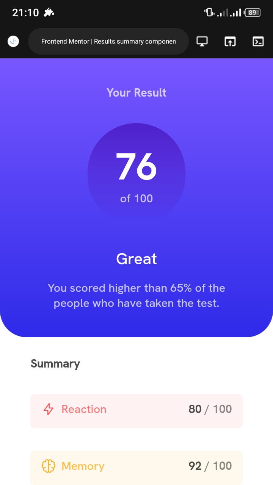
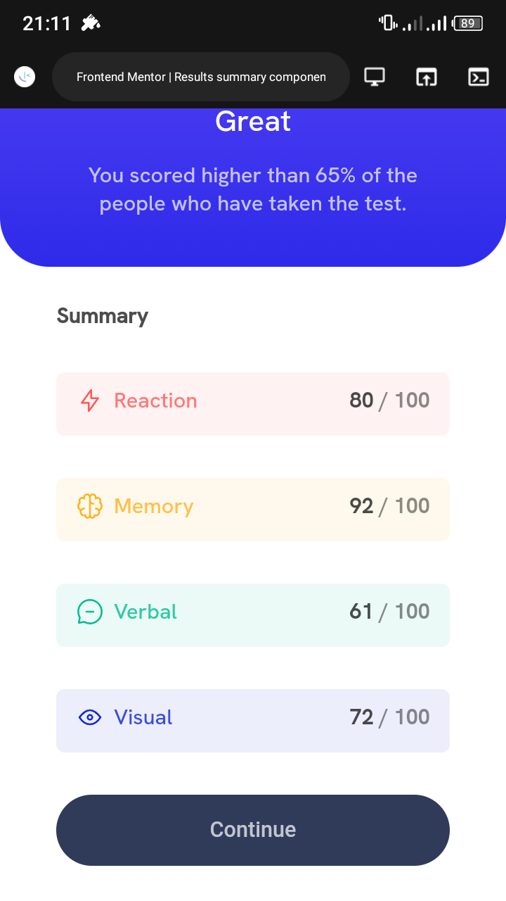
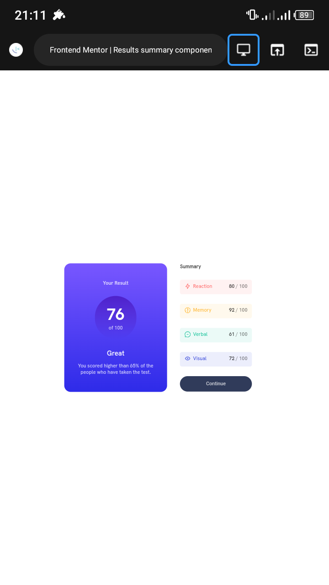

# Frontend Mentor - Results summary component solution

This is a solution to the [Results summary component challenge on Frontend Mentor](https://www.frontendmentor.io/challenges/results-summary-component-CE_K6s0maV). Frontend Mentor challenges help you improve your coding skills by building realistic projects.

## Table of contents

- [Overview](#overview)
  - [The challenge](#the-challenge)
  - [Screenshot](#screenshot)
  - [Links](#links)
- [My process](#my-process)
  - [Built with](#built-with)
  - [What I learned](#what-i-learned)
  - [Continued development](#continued-development)
  - [Useful resources](#useful-resources)
- [Author](#author)
- [Acknowledgments](#acknowledgments)

**Note: Delete this note and update the table of contents based on what sections you keep.**

## Overview

### The challenge

Users should be able to:

- View the optimal layout for the interface depending on their device's screen size
- See hover and focus states for all interactive elements on the page
- **Bonus**: Use the local JSON data to dynamically populate the content

### Screenshot





### Links

- Solution URL: [Add solution URL here](https://tamuno1383482586/results-summary-component-project/)
- Live Site URL: [Add live site URL here](https://tamuno1383482586.github.io/results-summary-component-project/)

## My process

### Built with

- Semantic HTML5 markup
- CSS custom properties
- Flexbox
- Mobile-first workflow

### What I learned

This is indeed an awesome project i learned how to use json file to update the data in the HTML DOM

To see how you can add code snippets, see below:

```html
<p class="reaction-para">
  <span
    ><svg
      xmlns="http://www.w3.org/2000/svg"
      width="20"
      height="20"
      fill="none"
      viewBox="0 0 20 20"
    >
      <path
        stroke="#F55"
        stroke-linecap="round"
        stroke-linejoin="round"
        stroke-width="1.25"
        d="M10.833 8.333V2.5l-6.666 9.167h5V17.5l6.666-9.167h-5Z"
      /></svg
  ></span>
  <span class="grading-category" id="reaction">Reaction</span>
  <span class="right-floated"><span class="bold-text">80</span> / 100</span>
</p>
```

```css
#reaction {
  color: hsla(0, 100%, 67%, 0.8);
  font-family: myFirstFontMedium;
}
```

```js
let fetchRequest = fetch("data.json");
let category = document.querySelectorAll(".grading-category");
let icon;
let score;
var right_floated_scores = document.querySelectorAll(".right-floated");

let i = 0;

fetchRequest
  .then((response) => {
    return response.json();
  })
  .then((data) => {
    data.forEach((data) => {
      let right_floated_scores_child_span = right_floated_scores[i];
      right_floated_scores_child_span.children[0].innerHTML = data["score"];
      category[i].innerHTML = data.category;
      i++;
    });
  });
```

```json
[
  {
    "category": "Reaction",
    "score": 80,
    "icon": "./assets/images/icon-reaction.svg"
  },
  {
    "category": "Memory",
    "score": 92,
    "icon": "./assets/images/icon-memory.svg"
  },
  {
    "category": "Verbal",
    "score": 61,
    "icon": "./assets/images/icon-verbal.svg"
  },
  {
    "category": "Visual",
    "score": 72,
    "icon": "./assets/images/icon-visual.svg"
  }
]
```

### Continued development

Advanced UI/UX components
Framework like React.js or Angular.js
CSS Grid

### Useful resources

- [Example resource 1](https://chat.openai.com) - This helped me because i forgot how to load local custom fonts on an html and css and javascript project

## Author

- Website - [Tamuno Divine]
- Frontend Mentor - [@Tamuno1383482586](https://www.frontendmentor.io/profile/Tamuno1383482586)
- Twitter - [@DivineTamuno](https://mobile.twitter.com/DivineTamuno)

## Acknowledgments

In future projects i would like to collaborate with team members but this
project was single handely completed by me

```

```
